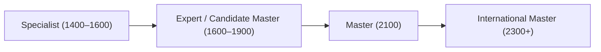

# ICPC & Competitive Programming Master Plan — Zero to International Master

**Start Date:** 16 September 2026  
**ICPC Preliminary Round:** 3 October 2026 (17-Day Intensive Sprint)  
**On-Site Regionals & Meta Hacker Cup Phase:** 4 October → Late November / Early December 2026  
**Master & International Master (IM 2300+) Phase:** December 2026 & Beyond  
**Target Sites:** ICPC Kanpur & Amritapuri Regionals  
**Sleep Schedule (Sprint Phase):** 1:00 AM / 1:30 AM → 8:30 AM / 9:00 AM (Daytime Contest Aligned)  
**Rating Progression:** 1300–1600 (Prelim) $\to$ 1600–1850 (Regionals) $\to$ 1900–2100 (Master) $\to$ 2300+ (International Master)  

---

## 1. Ground Truth & Strategic Calibration

### The IIT Guwahati Reality & The College Quota
IIT Guwahati is one of the most competitive ICPC environments in India (20+ active teams, CMs, Masters, and INOI veterans). 
* **The Real Gate:** The institute quota limits qualification to the **top 2 to 4 teams per college per regional site** (Amritapuri ~3–4 teams, Kanpur ~2–3 teams).
* **The Qualifying Score:** The top 2 IITG teams typically solve 4–6 problems. To secure the 3rd or 4th qualifying slot, a team **must solve 3 problems cleanly with near-zero penalties**, with a strong push on Problem 4. 
* **The Qualification Formula:**
  * 2 Problems Solved $\implies$ 0% chance of qualification.
  * 3 Problems + 4 WAs $\implies$ Eliminated on penalty tie-breaks.
  * 3 Problems + 0–1 WA (under 120 mins) $\implies$ **~85% qualification probability**.
  * 4 Problems Solved $\implies$ **Guaranteed Regional qualification**.

### Team Profiles & Role Allocation
* **`adarak` (Specialist / Peak 1678):** 422 problems solved. **91.4% submission accuracy** (427 OK vs 40 WA). Strong foundation in math/greedy invariants, two pointers, and binary search. Role: Clean, zero-penalty execution on Problems 1 & 2, lead derivation on Problem 3.
* **`12crack_head` (Pupil / 1241):** 957 problems solved (188 in 1500–1600, 138 in 1700–1800). Broad algorithmic pattern exposure. Role: Rapid prototyping, graph traversals, and stress-testing.
* **`ShinChan5` (Specialist / 1444):** 93 contests, 967 problems solved (261 Problem C's, 139 Problem D's). Team Lead. Role: Contest pacing, problem selection, constructive algorithms, and TRD verification.

### Targeted Topic Focus (The 4-Problem ICPC Model)
Prelim qualification hinges on rapid, flawless execution on high-frequency topics appearing in Problems 1 through 4:
1. **Ad-hoc & Greedy Invariants** (up to 1600) — Rapid Problem 1 execution with 0 penalties.
2. **Two Pointers & Sliding Window** (up to 1650) — Dominates Problem 2 & 3.
3. **Binary Search on Answer** (up to 1650) — Monotonic feasibility predicates in Problem 2 & 3.
4. **Number Theory & Modular Arithmetic** (up to 1600) — Core Problem 2 math.
5. **Graph BFS / Shortest Paths / DSU** (up to 1700) — Dominates Problem 3 & 4.

---

## 2. The 25 Core Patterns Checklist (1300–1500 Arsenal)

At the 1300–1500 level, competitive programming revolves around approximately **25 canonical patterns**. Mastering 3 to 4 variations of each pattern (~80–100 problems total across the sprint) builds complete problem-solving versatility:

- [ ] **1. Prefix Sums & Prefix XOR:** $O(1)$ range queries without trees.
- [ ] **2. Difference Arrays:** $O(1)$ range updates, $O(N)$ sweep reconstruction.
- [ ] **3. Two Pointers (Opposite Ends):** Pair sums, palindromes, container boundaries.
- [ ] **4. Two Pointers / Sliding Window (Same Direction):** Subarrays with frequency maps.
- [ ] **5. Coordinate Compression:** Compressing coordinates $10^9 \to 2 \cdot 10^5$.
- [ ] **6. Binary Search on Answer:** Monotonic feasibility predicates ("Can we achieve $X$?").
- [ ] **7. Monotonic Stack:** Nearest smaller/greater element in $O(N)$, histogram areas.
- [ ] **8. Greedy Exchange Arguments:** Sorting by deadline, end-time, or ratios ($A_i/B_i$).
- [ ] **9. Contribution to Total Sum:** Counting how many subarrays or pairs element $i$ contributes to.
- [ ] **10. Parity & Invariants under Swaps:** Even/odd parity, cycle counts, permutation parity.
- [ ] **11. Working Backwards:** Reversing the simulation starting from the target state.
- [ ] **12. Modular Arithmetic Basics:** Fast exponentiation `pow_mod`, Fermat's inverse $a^{M-2} \pmod M$.
- [ ] **13. Sieve & Prime Factorization:** $O(N \log \log N)$ sieve, prime omega, divisor precomputation.
- [ ] **14. GCD / LCM Invariants:** Prefix/suffix GCDs, $\gcd(a, b) = \gcd(a, b - a)$.
- [ ] **15. Bitwise Independence:** Processing bit $0$ to bit $30$ as 30 independent 1D problems.
- [ ] **16. Bitmask Brute Force:** Subsets for $N \le 20$ ($2^N$ states).
- [ ] **17. 1D Dynamic Programming:** State formulation, jump transitions, memory reduction.
- [ ] **18. Knapsack / Subset Sum DP:** 0/1 knapsack, space compression to 1D array.
- [ ] **19. Grid DP:** Counting paths, blocking cells, DAG transitions on matrices.
- [ ] **20. Graph BFS / Flood Fill:** 2D grid components, unweighted shortest paths.
- [ ] **21. Disjoint Set Union (DSU):** Cycle detection, connected components, Kruskal's MST.
- [ ] **22. Tree Traversal & Diameters:** Subtree sizes, 2-BFS tree diameter.
- [ ] **23. Constructive & Checkerboard Patterns:** Parity coloring, alternating placements.
- [ ] **24. Small $N$ Manual Brute Force:** Testing $N \le 4$ on paper to reveal hidden formulas.
- [ ] **25. Custom Sorting & Tie-Breaking:** Multi-key sorting with lambdas and structs.

---

## 3. Daily Problem Quota & Practice Volume

* **Daily Target:** **6 to 8 focused problems per day**.
* **Rationale:** Quality and deep derivation outpace shallow volume. Solving 15–20 low-rated problems generates superficial speed without developing pattern recognition for 1400–1650 problems. Solving 6–8 well-chosen problems (2–3 CSES foundational drills, 3–4 Codeforces ladder problems, 1 past prelim challenge) ensures sustainable daily progress across all 25 core patterns without cognitive fatigue.

---

## 4. Active Derivation & Contest Discipline Protocol

To build rigorous, contest-ready independent problem-solving:

1. **Timed Solo Conditions:** Complete ladder blocks in total isolation with zero external discussion or hints.
2. **Paper-First Derivation (20-Minute Minimum):**
   * Do not touch the keyboard immediately.
   * Manually trace small samples on paper ($N = 3, 4, 5$).
   * Identify core mathematical properties: *What invariant holds? Does sorting help? Is the predicate monotonic? What is the parity?*
3. **Constraint Reverse-Engineering:**
   * $N \le 20 \implies O(2^N)$ (Bitmask / Brute Force)
   * $N \le 500 \implies O(N^3)$ (Floyd-Warshall, 3-nested loops)
   * $N \le 2000 \implies O(N^2)$ (2D DP, all-pairs checking)
   * $N \le 2 \cdot 10^5 \implies O(N \log N)$ or $O(N)$ (Sorting, Two Pointers, Binary Search, Prefix Sums, BFS/DFS, DSU)
4. **Strict Editorial Discipline:**
   * **1200–1400 problems:** Give 25–30 minutes of independent paper derivation. If stuck, read *only the first hint*.
   * **1400–1650 problems:** Give 40–50 minutes on paper. If stuck, read the observation paragraph, close the editorial, and implement completely from scratch.
   * Never copy or read full editorial implementations before coding.

---

## 5. Daily Schedule (13.5–14h Intensive Protocol — Sprint Phase)

To sustain high-volume daily training without cognitive exhaustion, the sprint schedule employs **Cognitive Periodization (The 4-Gear System)**: cycling between analytical problem solving, mechanical implementation, theory ingestion, and reflection.

| Time | Block & Gear | Focus |
|---|---|---|
| **8:30 – 9:00 AM** | Wake & Prep | Physical alertness, morning routine |
| **9:00 – 10:30 AM** (1.5h) | **Block 1A: Lecture Ingestion (Gear 1)** | Watch the day's designated TLE video at $1.25\times/1.5\times$ speed |
| **10:30 – 1:00 PM** (2.5h) | **Block 1B: CSES Foundation (Gear 3)** | Code template from memory on paper & IDE + solve 2–3 CSES foundation problems |
| **1:00 – 2:00 PM** (1.0h) | Lunch & Walk | Complete mental break, walk away from screens |
| **2:00 – 5:30 PM** (3.5h) | **Block 2: Solo CF Ladder (Gear 2 — Peak RPM)** | Timed solo contest simulation:<br>• 1x 1100 warm-up (< 10m, strictly 0 WA)<br>• 2x 1300–1400 (20–25m paper derivation)<br>• 1x 1500–1600 (35–45m deep observation)<br>• 1x 1600–1700 (stretch ceiling) |
| **5:30 – 6:15 PM** (45m) | Break & Dinner | Step away from workstation, dinner |
| **6:15 – 9:15 PM** (3.0h) | **Block 3: ICPC Prelim & Speedrun (Gear 2 & 3)** | Past Prelim Problem (Gym 106179 / CodeDrills) + Speedrun 2 easy problems + Stress-testing |
| **9:15 – 9:45 PM** (30m) | Rest & Eye Relief | Screen-free relaxation, hydration |
| **9:45 – 11:45 PM** (2.0h) | **Block 4: Deep Upsolving & Code Analysis (Gear 4)** | Upsolve failed problems + analyze GM/Master accepted implementations on Codeforces |
| **11:45 – 12:45 AM** (1.0h) | **Block 5: Bug Logging & Review (Gear 4)** | Log errors and edge cases into `BUG_LOG.md`, formula review |
| **12:45 – 1:15 AM** | Wind Down | Zero screens, prepare for sleep |
| **1:15 – 8:30 AM** (7.25h) | **Deep Sleep** | Non-negotiable neural consolidation and recovery |

**Total Pure CP Work:** ~13.5 hours per day.

### Video Lecture Reference Library (`~/Downloads/Courses`):
Video material is used as targeted reference rather than passive viewing:
* **Level 2 Course / Self Paced:** Prefix Sums, Difference Arrays (`week6`), Monotonic Stacks (`week3`), Binary Search (`29.Binary_Search.mp4`, `30.Binary_Search-Problem-solving.mp4`).
* **Level 3 Self Paced & Course:** Two Pointers & Sliding Window (`Week 6` / `11.Two_Pointers_Introduction.mp4`, `9.Sliding_Window.mp4`), Number Theory (`Week 7` / `14.Number_Theory_1.mp4`, `15.Number_Theory_2.mp4`), Greedy Algorithms (`Week 2` / `1.Greedy_Algoritham_1.mp4`, `20.Greedy_Algo_2.mp4`).
* **Level 4 Course:** DP Beginner & Intermediate (`Week 1 & 2`), Graphs BFS/DFS (`Week 8`), DSU & Shortest Paths (`Week 9 & 10`).

---

## 6. Penalty Control, Contest Tactics & Stress Testing

### The 20-Minute Penalty Rule
In ICPC, penalty = `(Submission Time in Minutes) + (20 × Rejected Submissions)`.  
* **Team A:** 3 solves at 40m, 80m, 120m with 0 penalties = **240 total penalty**.
* **Team B:** 3 solves at 40m, 80m, 120m with 4 WAs = **320 total penalty**.  
**Team A qualifies over Team B.** At the institute quota boundary, penalty minimization is decisive.

### Stress-Testing Script (`stress.py`)
To eliminate penalties on tricky logic or edge cases, run a local stress test against a naive brute force:

```python
# stress.py - Put in your CP directory
import random, subprocess, sys

def generate_test():
    n = random.randint(1, 10)
    a = [random.randint(1, 20) for _ in range(n)]
    return f"{n}\n" + " ".join(map(str, a)) + "\n"

# Loop until a mismatch occurs
for t in range(1, 1000):
    test = generate_test()
    with open("in.txt", "w") as f: f.write(test)
    
    out_fast = subprocess.check_output("./solution < in.txt", shell=True).decode()
    out_brute = subprocess.check_output("./brute < in.txt", shell=True).decode()
    
    if out_fast.strip() != out_brute.strip():
        print(f"Failed on test {t}:")
        print(test)
        print(f"Fast: {out_fast} | Brute: {out_brute}")
        sys.exit(0)
print("All 1000 tests passed!")
```

---

## 7. PART I: 17-DAY PRELIM SPRINT (16 Sep → 3 Oct)

Every day pairs **CSES foundational mastery** with **Codeforces 1300–1700 targeted practice** and **Past ICPC Prelim problems**.

---

### Day 1 (Wed, 16 Sep) — Foundation & Kickoff (Special 4:00 PM Start)

| Time | Block | Tasks |
|---|---|---|
| **1:40 – 3:15 PM** | **Pre-Start** | Complete `29.Binary_Search.mp4` & `30.Binary_Search-Problem-solving.mp4` (Level 2 Self Paced). |
| **3:15 – 4:00 PM** | **Prep** | Review formulas, notebook ready at desk. |
| **4:00 – 6:30 PM** (2.5h) | **Block 1: CSES Foundation** | **1.** [*Distinct Numbers*](https://cses.fi/problemset/task/1621) (Sorting baseline, 10m)<br>**2.** [*Static Range Sum Queries*](https://cses.fi/problemset/task/1646) (Prefix sums baseline, 15m)<br>**3.** [*Maximum Subarray Sum*](https://cses.fi/problemset/task/1643) (Kadane’s / prefix min, 25m)<br>**Drill:** Write 2D prefix sum formula from memory on paper. |
| **6:30 – 7:00 PM** (30m) | **Break** | Screen-free rest, stretch. |
| **7:00 – 9:30 PM** (2.5h) | **Block 2: Solo CF Ladder** | Timed solo contest simulation:<br>• **1x 1000** (Warm-up, strictly 0 WA, < 10m)<br>• **2x 1200–1300** (`math`, `implementation`, 20–25m paper derivation)<br>• **1x 1400–1500** (`greedy`, `sortings`, 35–45m) |
| **9:30 – 10:15 PM** (45m) | **Dinner** | Meal & break. |
| **10:15 – 11:30 PM** (1.25h) | **Block 3: Past Prelim Problem** | Solve **Buy K Get 1 Free** (official ICPC 2024 Prelim / [Gym 106179](https://codeforces.com/gym/106179)).<br>Verify constraints, dry-run $N=1$, submit with **zero penalties**. |
| **11:30 – 12:45 AM** (1.25h) | **Block 4: Bug Log & Review** | • Log any WAs, TLEs, or edge cases in `BUG_LOG.md`.<br>• Upsolve today's hardest problem. |
| **12:45 – 1:15 AM** | **Wind Down & Sleep** | Shut off all screens. Rest by 1:15 AM for standard 8:30 AM schedule on Day 2. |

---

### Day 2 (Thu, 17 Sep) — Prefix Sums, Difference Arrays & Prefix XOR
* **Goal:** Range query and range update operations in $O(1)$ without trees.
* **TLE Lecture (Block 1):** `TLE Eliminators 7.0 Batch - Level 2 Course/week6/` (Difference Array & 2D Prefix Sums)
* **CSES Problemset:**
  1. [*Range Xor Queries*](https://cses.fi/problemset/task/1650) (Solve via prefix XOR in $O(1)$, NOT segment tree!)
  2. [*Subarray Sums I*](https://cses.fi/problemset/task/1660) (Prefix sums + map)
  3. [*Subarray Divisibility*](https://cses.fi/problemset/task/1662) (Prefix sums + modulo logic)
* **Codeforces Solo Block:**
  - 2x 1300–1400 (`data structures`, `prefix sums`)
  - 1x 1500–1600 (`constructive algorithms`)
* **Implementation Drill:** 2D prefix sums and difference array update/reconstruct from memory.

---

### Day 3 (Fri, 18 Sep) — Two Pointers & Sliding Window (Problem 2 & 3 Core)
* **Goal:** Turn $O(N^2)$ subarray/pair searches into $O(N)$. Master coordinate sorting.
* **TLE Lecture (Block 1):** `TLE Eliminators 7.0 Batch - Level 3 Self Paced/11.Two_Pointers_Introduction.mp4` & `9.Sliding_Window.mp4` (or `Level 3 Course/Week 6` by Priyansh Agarwal)
* **CSES Problemset:**
  1. [*Ferris Wheel*](https://cses.fi/problemset/task/1090) (Two pointers greedy pairing)
  2. [*Playlist*](https://cses.fi/problemset/task/1141) (Two pointers with hash map / frequency array)
  3. [*Sum of Three Values*](https://cses.fi/problemset/task/1641) (Sorting + two pointers $O(N^2)$)
* **Codeforces Solo Block:**
  - 2x 1300–1400 (`two pointers`)
  - 1x 1500–1650 (`two pointers`, `binary search`)
* **Past Prelim Problem:** *Collisions* (ICPC 2024 Prelim / [Gym 106179](https://codeforces.com/gym/106179)) — 1D coordinate sorting + two pointers.

---

### Day 4 (Sat, 19 Sep) — Binary Search on Answer (Problem 2 & 3 Core)
* **Goal:** Recognize "maximize the minimum" or monotonic feasibility predicates.
* **TLE Lecture (Block 1):** `TLE Eliminators 7.0 Batch - Level 3 Self Paced/2.Binary_Search_on_answer.mp4`
* **CSES Problemset:**
  1. [*Factory Machines*](https://cses.fi/problemset/task/1620) (Binary search on answer)
  2. [*Array Division*](https://cses.fi/problemset/task/1085) (Classic partition binary search)
  3. [*Concert Tickets*](https://cses.fi/problemset/task/1091) (`std::multiset::upper_bound`)
* **Codeforces Solo Block:**
  - 2x 1300–1400 (`binary search`)
  - 1x 1500–1650 (`binary search on answer`)
* **Implementation Drill:** Floating-point binary search vs integer binary search boundaries.

---

### Day 5 (Sun, 20 Sep) — Number Theory & Modular Arithmetic (Problem 2 Core)
* **Goal:** Master the math patterns that appear in Problem 2 of nearly every ICPC round.
* **Theory:** Fast binary exponentiation $O(\log P)$, Fermat's Little Theorem for inverse ($a^{M-2} \pmod M$), GCD / Sieve $O(N \log \log N)$.
* **TLE Lecture (Block 1):** `TLE Eliminators 7.0 Batch - Level 3 Self Paced/14.Number_Theory_1.mp4` & `15.Number_Theory_2.mp4` (or `Level 3 Course/Week 7`)
* **CSES Problemset:**
  1. [*Exponentiation*](https://cses.fi/problemset/task/1095) & [*Exponentiation II*](https://cses.fi/problemset/task/1712) (Binary exponentiation & Euler totient)
  2. [*Common Divisors*](https://cses.fi/problemset/task/1081) (GCD frequency counting in $O(N + V \log V)$)
  3. [*Counting Divisors*](https://cses.fi/problemset/task/1713) (Sieve precomputation)
* **Codeforces Solo Block:**
  - 2x 1300–1400 (`number theory`)
  - 1x 1500–1600 (`math`, `combinatorics`)
* **Past Prelim Problem:** *Bincatmod* (ICPC 2024 Prelim / [Gym 106179](https://codeforces.com/gym/106179)) — binary concatenation modulo $M$.

---

### Day 6 (Mon, 21 Sep) — Greedy Invariants & Exchange Arguments
* **Goal:** Prove why local optimal choices yield global solutions; master custom comparators.
* **TLE Lecture (Block 1):** `TLE Eliminators 7.0 Batch - Level 3 Self Paced/1.Greedy_Algoritham_1.mp4` & `20.Greedy_Algo_2.mp4`
* **CSES Problemset:**
  1. [*Movie Festival*](https://cses.fi/problemset/task/1629) (Interval scheduling)
  2. [*Tasks and Deadlines*](https://cses.fi/problemset/task/1630) (Exchange argument: shortest deadline first)
  3. [*Towers*](https://cses.fi/problemset/task/1073) (Greedy placement with multiset / binary search)
* **Codeforces Solo Block:**
  - 2x 1300–1400 (`greedy`)
  - 1x 1500–1650 (`greedy`, `exchange argument`)
* **Past Prelim Problem:** *Reduction Game* (ICPC 2023 Prelim / CodeDrills) — greedy sorting logic.

---

### Day 7 (Tue, 22 Sep) — Monotonic Stacks & Queues (Problem 3 & 4 Core)
* **Goal:** Finding the nearest smaller/greater element in $O(N)$; subarray range extrema.
* **TLE Lecture (Block 1):** `TLE Eliminators 7.0 Batch - Level 2 Course/week3/` (Stack, Monotonic Stack & Queue)
* **CSES Problemset:**
  1. [*Nearest Smaller Values*](https://cses.fi/problemset/task/1645) (Classic monotonic stack)
  2. [*Advertisement*](https://cses.fi/problemset/task/1142) (Largest rectangle under histogram — pure monotonic stack)
* **Codeforces Solo Block:**
  - 2x 1300–1450 (`data structures`, `monotonic stack`)
  - 1x 1500–1650 (`stacks`)
* **Past Prelim Problem:** *Game-2048* (ICPC 2024 Prelim / [Gym 106179](https://codeforces.com/gym/106179)) — stack simulation.

---

### Day 8 (Wed, 23 Sep) — Graph BFS, DFS & 2D Grids (Problem 3 Core)
* **Goal:** Grid traversals, connected components, shortest path in unweighted graphs.
* **TLE Lecture (Block 1):** `TLE Eliminators 7.0 Batch - Level 4 Course/Week 8/1. Graphs 1  05-06-2023 TLE 4 by Priyansh Agarwal.mp4`
* **CSES Problemset:**
  1. [*Counting Rooms*](https://cses.fi/problemset/task/1192) (Grid connected components)
  2. [*Labyrinth*](https://cses.fi/problemset/task/1193) (BFS shortest path + path reconstruction)
  3. [*Building Roads*](https://cses.fi/problemset/task/1666) & [*Building Teams*](https://cses.fi/problemset/task/1668) (Components & bipartite 2-coloring)
* **Codeforces Solo Block:**
  - 2x 1300–1400 (`dfs and similar`, `graphs`)
  - 1x 1500–1650 (`graphs`, `shortest paths`)
* **Implementation Drill:** 2D grid direction vectors `dx[]/dy[]` and path reconstruction with parent pointer.

---

### Day 9 (Thu, 24 Sep) — Trees as Graphs & Tree Diameters
* **Goal:** Rooted trees, subtree sizes, tree traversal, diameter via 2-BFS.
* **TLE Lecture (Block 1):** `TLE Eliminators 7.0 Batch - Level 4 Course/Week 6/` (Trees Beginner / Tree Traversal)
* **CSES Problemset:**
  1. [*Subordinates*](https://cses.fi/problemset/task/1674) (Subtree size calculation)
  2. [*Tree Diameter*](https://cses.fi/problemset/task/1131) (2-BFS or DFS approach)
  3. [*Tree Distances I*](https://cses.fi/problemset/task/1132) (Prefix/suffix traversal or tree diameter property)
* **Codeforces Solo Block:**
  - 2x 1300–1400 (`trees`)
  - 1x 1500–1650 (`trees`, `dfs and similar`)

---

### Day 10 (Fri, 25 Sep) — DSU & Shortest Paths (Problem 3 & 4 Core)
* **Goal:** Connectivity updates, cycle detection, Dijkstra, Floyd-Warshall.
* **Theory:** 
  - Dijkstra $O((V + E) \log V)$ using `std::priority_queue`
  - 0–1 BFS using `std::deque`
  - Floyd-Warshall $O(V^3)$ (for dense graphs $V \le 400$)
  - DSU with path compression & size union $O(\alpha(N))$
* **TLE Lecture (Block 1):** `TLE Eliminators 7.0 Batch - Level 4 Course/Week 9/2. DSU  14-06-23 TLE Level 4 by Dev Karan.mp4` & `Week 10/1_Graphs_MST_+_floyd_Warshall_17_06_2023_TLE_Level_4_by_Dev_Karan.mp4`
* **CSES Problemset:**
  1. [*Shortest Routes I*](https://cses.fi/problemset/task/1671) (Dijkstra)
  2. [*Road Reparation*](https://cses.fi/problemset/task/1675) (Kruskal's MST with DSU)
  3. [*Road Construction*](https://cses.fi/problemset/task/1676) (DSU component count & maximum component size)
* **Codeforces Solo Block:**
  - 2x 1300–1400 (`dsu`, `graphs`)
  - 1x 1500–1650 (`dsu`, `shortest paths`)
* **Past Prelim Problem:** *Equations* (ICPC 2024 Prelim / [Gym 106179](https://codeforces.com/gym/106179)) — DSU graph cycle detection.

---

### Day 11 (Sat, 26 Sep) — Dynamic Programming I: Fundamentals & 1D
* **Goal:** State formulation, DAG transitions, eliminating recursion overhead.
* **TLE Lecture (Block 1):** `TLE Eliminators 7.0 Batch - Level 4 Course/Week 1/` (`Lecture 1.1 & 1.2 DP Beginner`) or `Level 3 Course/Week 9/1. DP 1 by Priyansh Agarwal.mp4`
* **CSES Problemset:**
  1. [*Dice Combinations*](https://cses.fi/problemset/task/1633) (1D state transition)
  2. [*Minimizing Coins*](https://cses.fi/problemset/task/1634) (Coin change min coins)
  3. [*Coin Combinations I*](https://cses.fi/problemset/task/1635) (Coin change ordered combinations)
  4. [*Removing Digits*](https://cses.fi/problemset/task/1637) (Greedy vs DP)
* **Codeforces Solo Block:**
  - 2x 1300–1400 (`dp`)
  - 1x 1500–1650 (`dp`)

---

### Day 12 (Sun, 27 Sep) — Dynamic Programming II: 2D & Knapsack
* **Goal:** Subset sum, 0/1 knapsack, space-optimized 1D arrays.
* **TLE Lecture (Block 1):** `TLE Eliminators 7.0 Batch - Level 4 Course/Week 2/` (`Lecture 2.1 & 2.2 DP Intermediate`) or `Level 3 Course/Week 9/2. DP 2 by Priyansh Agarwal.mp4`
* **CSES Problemset:**
  1. [*Grid Paths*](https://cses.fi/problemset/task/1638) (Grid counting DP)
  2. [*Book Shop*](https://cses.fi/problemset/task/1158) (Classic 0/1 Knapsack with 1D space optimization)
  3. [*Money Sums*](https://cses.fi/problemset/task/1745) (Subset sums via boolean DP)
* **Codeforces Solo Block:**
  - 2x 1300–1400 (`dp`)
  - 1x 1500–1650 (`dp`, `bitmasks`)

---

### Day 13 (Mon, 28 Sep) — Constructive & Invariant Thinking (Div 2 B/C Specialty)
* **Goal:** Solving non-standard problems where no textbook algorithm applies.
* **Theory:** Parity invariants, symmetry, working backward from target, small $N$ brute-forcing.
* **Codeforces Solo Block:**
  - 4x 1300–1500 problems tagged `constructive algorithms` / `math`.
  - Enforce 25 minutes of paper derivation before coding.
* **Stress Testing:** Setup `stress.py` and run against a brute force on 1 constructive problem.

---

### Day 14 (Tue, 29 Sep) — Team Strategy Sync & TRD Assembly
* **Team Sync (2 hours with `12crack_head` and `ShinChan5`):**
  - Define roles: Strategy for reading the problem set in the opening 10 minutes.
  - Enforce the **Zero Penalty Gatekeeper Rule**: Test $N=1$, max constraints, and overflow before every submission.
  - Assemble and review the 25-page printed Team Reference Document (TRD).
* **Solo Drill:** Timed speedrun of 4 problems (1200–1400). Target: 100% first-try AC.

---

### Day 15 (Wed, 30 Sep) — FULL 5-HOUR TEAM ICPC VIRTUAL CONTEST
* **Simulate Real Contest Conditions:**
  - Full 5-hour uninterrupted block (preferably 10:00 AM – 3:00 PM or 2:00 PM – 7:00 PM).
  - Use **Codeforces Gym 106179** (ICPC 2024 Online Preliminary) or ICPC Amritapuri/Kanpur 2023.
  - Enforce single-computer or strict machine coordination.
  - Track penalty time rigorously.
* **Post-Contest Analysis (2 hours):**
  - Categorize every unsolved or penalized problem:
    * *Missed observation*
    * *Implementation bug / Overflow*
    * *Problem triage order error*
  - Immediately upsolve the problem that was closest to AC.

---

### Day 16 (Thu, 1 Oct) — Virtual Upsolving & Speed Rehearsal
* **Morning:** Upsolve remaining 1–2 reachable problems from the Sep 30 contest.
* **Afternoon (3 hours):** Mini speed virtual (solve 3 easy-medium problems within 90 minutes).
* **Evening:** Template lock. Print your Team Reference Document. Review all entries in `BUG_LOG.md`.

---

### Day 17 (Fri, 2 Oct) — TAPER DAY (Rest & Mental Sharpness)
* **Taper Rule:** Keep problem-solving light to preserve peak analytical sharpness for contest day.
* **10:00 AM – 1:00 PM:** Light warm-up (2 easy Div 2 A/B problems to maintain rhythm).
* **2:00 – 4:00 PM:** Verify compiler flags, fast I/O snippets, team communication links, backup internet, contest portal logins.
* **Evening:** Balanced dinner, walk, relaxation. **Sleep strictly by 11:30 PM.**

---

### Day 18 (Sat, 3 Oct) — ICPC PRELIMINARY ROUND
* **Pre-Contest:** Balanced meal and hydration 45 minutes before start.
* **First 15 Minutes:**
  - `adarak` scans Problems A, B, C; `12crack_head` scans D, E; `ShinChan5` scans F, G.
  - Identify the easiest problem immediately.
* **During Contest:**
  - Put the first AC on the scoreboard within 25 minutes.
  - Never submit without dry-running $N = 1$, all-zeros, max constraints, and potential integer overflow.
  - If stuck for > 20 min with no progress, leave the keyboard, write the state on paper, or swap problems.

---

## 8. PART II: ON-SITE REGIONALS & META HACKER CUP PHASE (4 Oct → Late Nov / Early Dec)

Following the prelim, preparation shifts from rapid survival triage to genuine algorithmic depth: elevating your Codeforces rating from 1500 to 1800+ and preparing for on-site ICPC Regionals (Kanpur & Amritapuri) and Meta Hacker Cup Round 1 & 2.

### Phase Objectives
1. **Codeforces Rating:** Break into solid Expert (1600–1850).
2. **Meta Hacker Cup Focus:** Large input sizes ($T$ test cases, file I/O, recursion limit tuning, heavy corner-case defense).
3. **Advanced Algorithmic Foundation:** Segment Trees, Lazy Propagation, LCA, Combinatorics, and Graph Decompositions.

### Weekly Thematic Progression (October → November)

#### Week 1 (4–10 Oct): Range Queries (Fenwick & Segment Trees)
* **Core Concepts:** Point update range query, Segment Tree iterative vs recursive, Dynamic Range Minimum Queries, Inversion counting via Fenwick.
* **CSES Practice:**
  - [*Dynamic Range Sum Queries*](https://cses.fi/problemset/task/1648)
  - [*Dynamic Range Minimum Queries*](https://cses.fi/problemset/task/1649)
  - [*List Removals*](https://cses.fi/problemset/task/1749)
* **Codeforces Focus:** 1400–1600 range query problems.

#### Week 2 (11–17 Oct): Trees & Binary Lifting
* **Core Concepts:** Binary lifting on trees, LCA in $O(\log N)$, tree path queries, Euler tour representation (flattening tree into 1D array).
* **CSES Practice:**
  - [*Company Queries I*](https://cses.fi/problemset/task/1687) & [*Company Queries II*](https://cses.fi/problemset/task/1688)
  - [*Distance Queries*](https://cses.fi/problemset/task/1135)
  - [*Path Queries*](https://cses.fi/problemset/task/1138)
* **Codeforces Focus:** Tree DP and LCA applications (1500–1700).

#### Week 3 (18–24 Oct): Combinatorics & Math for Hacker Cup
* **Core Concepts:** Factorials, modular inverse factorials, stars and bars, inclusion-exclusion, linear sieve, pigeonhole principle.
* **CSES Practice:**
  - [*Binomial Coefficients*](https://cses.fi/problemset/task/1079)
  - [*Creating Strings II*](https://cses.fi/problemset/task/1715)
  - [*Distributing Apples*](https://cses.fi/problemset/task/1716)
  - [*Christmas Party*](https://cses.fi/problemset/task/1717) (Derangements)
* **Meta Hacker Cup Prep:** Practice past Hacker Cup Practice / Round 1 problems under timed file I/O.

#### Week 4 (25–31 Oct): Advanced DP & Segment Tree with Lazy Propagation
* **Core Concepts:** Range update range query, Lazy propagation pushdown pattern, Bitmask DP fundamentals ($O(N \cdot 2^N)$).
* **CSES Practice:**
  - [*Range Update Queries*](https://cses.fi/problemset/task/1651)
  - [*Polynomial Queries*](https://cses.fi/problemset/task/1736)
  - [*Matching*](https://cses.fi/problemset/task/2185) (Bitmask DP)
* **Codeforces Focus:** 1500–1750 DP and Segment Tree problems.

#### Week 5 (1–7 Nov): Graph Theory (SCC, 2-SAT & Bipartite Matching)
* **Core Concepts:** Strongly Connected Components (Tarjan / Kosaraju), 2-SAT implication graphs, Kuhn's algorithm for Maximum Bipartite Matching.
* **CSES Practice:**
  - [*Flight Routes Check*](https://cses.fi/problemset/task/1682) (SCC connectivity)
  - [*Coin Collector*](https://cses.fi/problemset/task/1686) (Condensation DAG + DP)
  - [*Giant Pizza*](https://cses.fi/problemset/task/1684) (2-SAT formulation)
  - [*School Dance*](https://cses.fi/problemset/task/1696) (Bipartite Matching)

#### Week 6 (8–14 Nov): String Algorithms & Hashing
* **Core Concepts:** Polynomial rolling hash (double hashing to prevent anti-hash tests), KMP prefix function $\pi[i]$, Z-algorithm.
* **CSES Practice:**
  - [*String Matching*](https://cses.fi/problemset/task/1753)
  - [*Finding Borders*](https://cses.fi/problemset/task/1732)
  - [*Minimal Rotation*](https://cses.fi/problemset/task/1110)
* **Codeforces Focus:** 1500–1700 string problems.

#### Weeks 7 & 8 (15–30 Nov): Full Regional Virtuals & On-Site Final Prep
* Run two full 5-hour Regional virtual contests per week with teammates (`ShinChan5` & `12crack_head`).
* Practice single-machine contest workflow: writing solutions on paper while a teammate debugs or implements on the terminal.
* Refine the printed Team Reference Document (TRD) to include advanced templates (Lazy SegTree, SCC, Kuhn's, Dinic's, 2-SAT).

---

## 9. PART III: MASTER & INTERNATIONAL MASTER (IM 2300+) BLUEPRINT (December 2026 & Beyond)

Once the ICPC Regional contest season concludes, competitive programming transitions from team triage into **individual algorithmic mastery**. Reaching Candidate Master (1900), Master (2100), and International Master (2300+) on Codeforces requires mastering deep theoretical topics, advanced structural invariants, and sophisticated optimization paradigms.

This phase is organized by **Thematic Mastery Pillars** rather than a day-by-day sprint.



---

### Tier 1: Candidate Master Foundation (1900 Rating Ceiling)
*Goal: Consistently solve Div 2 A, B, C under 40 minutes with zero penalties; solve Div 2 D in >60% of contests.*

#### 1. Advanced Range Queries & Decomposition
* **Merge Sort Tree:** Answering range frequency queries ("How many elements in $[L, R]$ are $\le K$?") in $O(\log^2 N)$.
* **Persistent Segment Tree:** Preserving historical versions after point updates; solving Range $K$-th Smallest queries in $O(\log N)$ without updates.
  - *CSES Benchmark:* [*Distinct Values Queries*](https://cses.fi/problemset/task/1734) (Offline Fenwick / Sqrt Decomposition).
* **Square Root Decomposition & Mo's Algorithm:** Answering offline range queries with state updates in $O((N + Q)\sqrt{N})$.

#### 2. Advanced Dynamic Programming
* **Digit DP:** Counting numbers in range $[L, R]$ satisfying digit constraints (states: `(index, tight, leading_zeros, sum)`).
* **DP on Trees with Rerooting:** Computing answers for all nodes as root in $O(N)$ via two DFS passes (in-out DP).
  - *CSES Benchmark:* [*Tree Distances II*](https://cses.fi/problemset/task/1133).
* **Bitmask DP with SOS (Sum Over Subsets):** Transitioning over submasks in $O(N \cdot 2^N)$ rather than $O(3^N)$.
  - *CSES Benchmark:* [*Counting Bits*](https://cses.fi/problemset/task/1653) (Elevator Rides).

#### 3. Advanced Number Theory
* **Matrix Exponentiation:** Evaluating linear recurrences of order $K$ in $O(K^3 \log N)$ (e.g., transitions on DAGs, generalized Fibonacci, counting paths of exact length $K$).
* **Extended Euclidean & Chinese Remainder Theorem (CRT):** Solving systems of linear congruences with coprime and non-coprime moduli.

---

### Tier 2: Master Transition (2100 Rating Ceiling)
*Goal: Consistently solve Div 2 D and Div 2 E; reach positive delta in Div 1 contests (Div 1 A & B solved fast).*

#### 1. Tree Decomposition Paradigms
* **Heavy-Light Decomposition (HLD):** Decomposing trees into heavy and light chains to support arbitrary path updates and path queries in $O(\log^2 N)$ using Segment Trees.
  - *CSES Benchmark:* [*Path Queries II*](https://cses.fi/problemset/task/2134).
* **Centroid Decomposition:** Divide-and-conquer on trees by recursively splitting at the centroid; answering paths of length $K$ or optimization queries in $O(N \log N)$.
* **DSU on Tree (Sack / Small-to-Large Merging):** Offline subtree query answering in $O(N \log N)$ by keeping the heaviest child's state.

#### 2. Dynamic Programming Optimization Techniques
* **Convex Hull Trick (CHT) & Li Chao Tree:** Optimizing transitions of the form $DP[i] = \min_{j < i} (DP[j] + M_j \cdot X_i)$ from $O(N^2)$ to $O(N \log N)$ or $O(N)$.
* **Divide & Conquer DP Optimization:** Applicable when the optimal transition point $opt(i, j) \le opt(i, j+1)$ (quadrangle inequality); reduces 2D DP from $O(K \cdot N^2)$ to $O(K \cdot N \log N)$.
* **Knuth's Optimization:** Reduces transitions $opt(i, j-1) \le opt(i, j) \le opt(i+1, j)$ from $O(N^3)$ to $O(N^2)$.
* **Aliens Trick (WQS Binary Search / Lagrangian Relaxation):** Removing a $K$-element constraint by penalizing each chosen element with $\lambda$, binary searching for $\lambda$.

#### 3. Network Flow & Matching
* **Dinic's Algorithm:** Maximum flow in $O(V^2 E)$, and $O(E \sqrt{V})$ on unit networks / bipartite graphs.
  - *CSES Benchmark:* [*Download Speed*](https://cses.fi/problemset/task/1694).
* **Min-Cut Equivalence:** Max-Flow Min-Cut theorem; projecting selection problems (choosing profit items subject to dependencies) onto minimum $S\text{-}T$ cut.
  - *CSES Benchmark:* [*Police Chase*](https://cses.fi/problemset/task/1695).
* **Min-Cost Max-Flow (MCMF):** Successive shortest path algorithm with SPFA / Dijkstra with potentials.

#### 4. Game Theory
* **Sprague-Grundy Theorem:** Impartial games played on DAGs; computing nim-values (mex of reachable states) and XOR-sum equivalence to Nim.

---

### Tier 3: International Master Mastery (2300+ Rating Ceiling)
*Goal: Solve Div 1 C consistently; compete at world-class levels in Meta Hacker Cup Round 2/3 and ICPC World Finals level.*

#### 1. Advanced String Structures
* **Suffix Automaton (SAM):** The minimal DFA recognizing all substrings of a string in $O(N)$ time and states. Solves distinct substring count, longest common substring of multiple strings, and occurrences in $O(\text{length})$.
* **Suffix Array + LCP (Kasai's Algorithm):** Suffix sorting in $O(N \log N)$ or $O(N)$, combined with Range Minimum Query for arbitrary Longest Common Prefix queries.
* **Aho-Corasick Automaton:** Multi-pattern string searching and DP transitions on trie with failure links.
  - *CSES Benchmark:* [*Word Combinations*](https://cses.fi/problemset/task/1731).

#### 2. Linear Algebra & Polynomial Algorithms
* **Linear Basis (XOR Basis via Gaussian Elimination):** Answering maximum XOR subset, subarray XOR span, and cycle bases in $O(B)$ per insertion ($B \le 60$).
* **Fast Fourier Transform (FFT) & Number Theoretic Transform (NTT):** Multiplying polynomials of degree $N$ in $O(N \log N)$; string matching with wildcards; subset sum convolutions.
* **Generating Functions & Berlekamp-Massey:** Finding linear recurrences directly from the first $2K$ terms in $O(K^2)$.

#### 3. High-End Data Structures & Graph Theory
* **Segment Tree Beats (Historical Updates):** Range Chmin/Chmax queries and range sum in $O((N + Q) \log N)$ using conditional segment tree tags.
* **Link-Cut Trees (LCT):** Dynamic forest connectivity and path queries under edge insertions and deletions in $O(\log N)$ amortized time.
* **Matroid Intersection:** Finding common independent sets across two matroids (e.g., colorful spanning trees, directed spanning trees) in polynomial time.

#### 4. The Div 1 Constructive Paradigm Shift
At the 2300+ level, competitive programming shifts away from standard algorithm lookups toward **abstract invariant synthesis**:
* **Dimension Reduction:** Transforming multi-dimensional constraints into independent 1D problems or projective duals.
* **Extremal Principle:** Analyzing the maximum/minimum element or boundary configuration to prove uniqueness.
* **Potential Functions:** Proving termination or bounding operations in interactive/adversarial constructive problems.

---

### Post-ICPC Long-Term Sustainable Engine (4–6h Daily Protocol)
After the full-time sprint phase, long-term mastery demands an academically sustainable daily routine:

| Daily Block | Duration | Focus |
|---|---|---|
| **Deep Thinking Block** | 2.0 – 2.5 hours | **1 to 2 hard problems (1900–2400 rated)** on Codeforces or AtCoder (AGC/ARC). Spend 60–90 minutes with pen and paper before consulting any hint. |
| **Upsolving & Derivation Block** | 1.5 – 2.0 hours | Code the derived solution completely independently. Analyze accepted implementations from International Grandmasters to observe elegant invariant formulations. |
| **Virtual Contest Block (2x/week)** | 2.5 – 3.0 hours | Compete in rated or unrated Div 1/Div 2 virtual contests under timed conditions to maintain contest speed and emotional composure. |

---

## 10. Problem Tracking & Repository Architecture

Recommended repository structure for long-term preparation:

```text
~/icpc/
├── readme.md            # Master strategic plan & complete roadmap
├── BUG_LOG.md           # Every penalty, bug, and edge-case analyzed
├── TRD/                 # Team Reference Document & Standard Templates
│   ├── math.cpp         # Modular inverse, sieve, matrix exponentiation, linear basis
│   ├── data_structures.cpp # SegTree, Lazy SegTree, Fenwick, Persistent SegTree
│   ├── trees.cpp        # LCA, Binary Lifting, HLD, Centroid Decomposition
│   ├── graphs.cpp       # Dijkstra, DSU, SCC (Tarjan), Dinic's Max Flow
│   └── stress.py        # Automated local stress testing engine
└── upsolving/           # Clean, documented solutions for contest problems
    ├── prelim_sprint/
    ├── regionals/
    └── master_ladder/
```

### Template for `BUG_LOG.md`
Whenever a WA or TLE occurs during training, document it before checking solutions:

```markdown
### [YYYY-MM-DD] - Problem Name (URL)
* **Verdict:** WA / TLE / MLE / RTE
* **Root Cause:** (e.g., integer overflow with `int` vs `long long`; incorrect boundary $N-1$ vs $N$; uncleared state between test cases)
* **Why was it missed?** (Rushed submission without verifying $N=1$)
* **Prevention Rule:** (Always test $N = 1$ and verify maximum cumulative constraints $\le 10^9$)
```

---

## 11. Core Tenets for Algorithmic Dominance

1. **Circadian Alignment:** Strictly maintain daytime contest hours; mental sharpness at 10:00 AM wins ICPC slots.
2. **Independent Derivation:** Paper derivation precedes implementation; never write code before the proof is solid.
3. **Zero-Penalty Discipline:** A 3-minute local stress test (`stress.py`) prevents 20-minute contest penalties that destroy college ranking.
4. **Depth Over Volume:** Solving 2 high-level problems through deep derivation builds more rating than grinding 15 trivial implementations.
5. **Continuous Reflection:** Log every single failure into `BUG_LOG.md`. The gap between Specialist and International Master is the systematic elimination of repeated mistakes.
